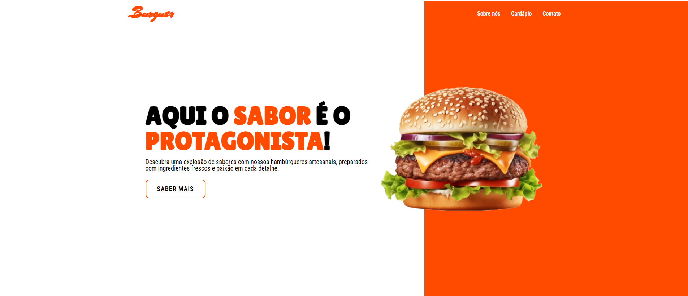

# .Burguer

  
  https://luanabolino.github.io/burguer/

## Descrição
O **Burguer** é uma landing page para uma hamburgueria, projetada para exibir informações sobre o cardápio, contato e localização do estabelecimento.

## Tecnologias Utilizadas
  

    
    
    
    
    
    
  

